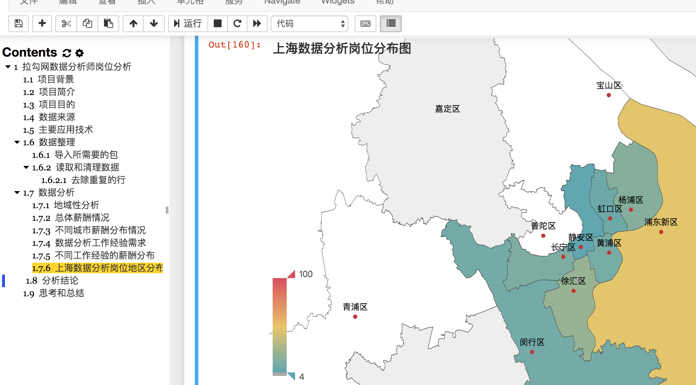

# 基于拉钩网的数据岗位分析
因为要从后端 PHP 转行数据分析，这里就对两者进行简单的比较，着重分析了数据分析的地域分布，给自己找工作做出指导。  

## 项目目的  
用实际的数据给自己做出指导和解决一些疑惑，主要针对以下几个问题？  
1. 数据分析岗位的城市分布情况，哪些城市是好的去处？  
2. 数据分析岗位薪资分布情况是怎样的，和 PHP 相比较如何？  
3. 数据分析岗位对工作经验的要求是怎么样，以及不同工作经验下的薪酬分布；  
4. 上海市不同地区的岗位分布情况

## 数据来源  
通过写的爬虫(lagouSpider 文件)，爬去相应的岗位数据  

## 项目目录  

